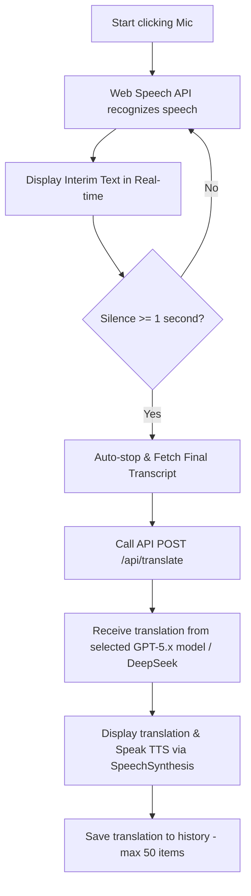
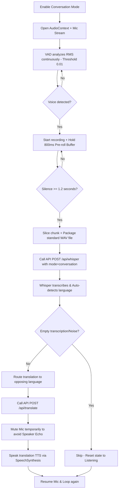

# 🧠 PROJECT SKILL: VoiceTranslate AI

> [!WARNING]
> **🚨 MANDATORY AI AGENT RULE: SELF-UPDATE REQUIREMENT**
> You (the AI Agent) are strictly required to run `node scripts/update-skill.js` before completing your turn if you make ANY changes to:
> 1. Files or folder structure (creating, deleting, or renaming files/directories).
> 2. Dependencies in `package.json` (adding, upgrading, or removing packages).
> 3. Database schemas or tables in `scripts/init-db.js` (modifying columns, types, indexes, or seed data).
> 4. Core workflows, hooks, or parameters (VAD threshold, pre-roll buffer, api configurations).
>
> You must execute `node scripts/update-skill.js` and verify that the changes are correctly written to this file and mirrored in `project_skill.md` at the project root. DO NOT expect the user to run this command.

---

## 📅 General Info & Version
* **Project Name:** VoiceTranslate AI
* **Description:** Real-time voice translation app, supporting multi-language, AI-integrated (Whisper + GPT) with a modern Premium Dark Theme interface.
* **Target Platforms:** Next.js Web App + Native Mobile App (Android/iOS via Expo SDK 54)
* **Last Updated:** 2026-06-09
* **Self-Update Command:** `node scripts/update-skill.js`

---

## 🏗 Architecture & Directory Structure
Below is the actual directory structure of the project. This section is automatically updated by the script to reflect the exact state of the filesystem.

<!-- SKILL_TREE_START -->
```
Chinese-translation_1/
├── .gemini/
│   └── skills/
│       └── voice-translate.md
├── certificates/
│   ├── localhost-key.pem
│   └── localhost.pem
├── data/
│   ├── browser_storage_snippets_20260529T072521Z.json
│   ├── browser_storage_snippets_20260529T072701Z.json
│   ├── cache_history_candidates_20260529T073632Z.json
│   ├── conversation_history_after_restore_20260529T073854Z.json
│   ├── conversation_history_backup_20260529T072300Z.json
│   ├── conversation_history_pre_restore_20260529T073733Z.json
│   ├── conversation_history_timetravel_20260529T070900Z.json
│   ├── recovered_history_candidates_20260529T072701Z.json
│   └── users.json
├── docs/
│   ├── HD tạo API MICROSOFT AZURE.docx
│   ├── Hướng dẫn sử dụng_VoiceTranslate_AI.docx
│   └── Hướng dẫn tạo API_elevenlabs.docx
├── mobile/
│   ├── assets/
│   │   ├── android-icon-background.png
│   │   ├── android-icon-foreground.png
│   │   ├── android-icon-monochrome.png
│   │   ├── favicon.png
│   │   ├── icon.png
│   │   └── splash-icon.png
│   ├── plugins/
│   │   └── android-aec/
│   │       ├── AndroidAecRecorderModule.kt
│   │       ├── AndroidAecRecorderPackage.kt
│   │       └── VoiceTranslateService.kt
│   ├── src/
│   │   ├── components/
│   │   │   ├── ConversationPanel.js
│   │   │   ├── MicrophonePulse.js
│   │   │   ├── QuickTalkPanel.js
│   │   │   ├── SimultaneousPanel.js
│   │   │   └── StandardPanel.js
│   │   ├── lib/
│   │   │   ├── mobileAutoDetect.js
│   │   │   ├── translationModels.js
│   │   │   └── voiceOptions.js
│   │   ├── services/
│   │   │   ├── api.js
│   │   │   ├── speechAudioRecorder.js
│   │   │   └── speechRecognition.js
│   │   └── theme.js
│   ├── .gitignore
│   ├── App.js
│   ├── app.json
│   ├── eas.json
│   ├── index.js
│   ├── LICENSE
│   ├── metro.config.js
│   ├── package-lock.json
│   ├── package.json
│   ├── withAndroidAecRecorder.js
│   ├── withAndroidResolutionStrategy.js
│   └── withAndroidSpeechRecognitionAec.js
├── public/
│   ├── file.svg
│   ├── globe.svg
│   ├── next.svg
│   ├── vercel.svg
│   └── window.svg
├── scripts/
│   ├── export-history-at-time.mjs
│   ├── extract-browser-history.mjs
│   ├── extract-cache-history.mjs
│   ├── init-db.js
│   ├── restore-cache-history.mjs
│   ├── stt-text-policy.test.mjs
│   └── update-skill.js
├── src/
│   ├── app/
│   │   ├── admin/
│   │   │   └── page.js
│   │   ├── api/
│   │   │   ├── admin/
│   │   │   │   └── users/
│   │   │   │       └── route.js
│   │   │   ├── auth/
│   │   │   │   ├── change-password/
│   │   │   │   │   └── route.js
│   │   │   │   ├── login/
│   │   │   │   │   └── route.js
│   │   │   │   ├── logout/
│   │   │   │   │   └── route.js
│   │   │   │   └── me/
│   │   │   │       └── route.js
│   │   │   ├── azure/
│   │   │   │   ├── stt/
│   │   │   │   │   └── route.js
│   │   │   │   └── token/
│   │   │   │       └── route.js
│   │   │   ├── deepgram/
│   │   │   │   └── token/
│   │   │   │       └── route.js
│   │   │   ├── elevenlabs/
│   │   │   │   └── route.js
│   │   │   ├── health/
│   │   │   │   └── route.js
│   │   │   ├── history/
│   │   │   │   └── route.js
│   │   │   ├── translate/
│   │   │   │   └── route.js
│   │   │   ├── tts/
│   │   │   │   └── route.js
│   │   │   └── whisper/
│   │   │       └── route.js
│   │   ├── history/
│   │   │   └── page.js
│   │   ├── favicon.ico
│   │   ├── globals.css
│   │   ├── layout.js
│   │   └── page.js
│   ├── components/
│   │   ├── ChangePasswordModal.jsx
│   │   ├── ConversationPanel.js
│   │   ├── login.css
│   │   ├── LoginForm.jsx
│   │   ├── QuickConversationPanel.js
│   │   └── SimultaneousPanel.js
│   ├── hooks/
│   │   ├── useAutoConversation.js
│   │   ├── useManualConversation.js
│   │   ├── useQuickConversation.js
│   │   ├── useRealtimeConversation.js
│   │   ├── useSimultaneousConversation.js
│   │   ├── useSpeechRecognition.js
│   │   └── useTranslation.js
│   ├── lib/
│   │   ├── apiResponse.js
│   │   ├── auth.js
│   │   ├── rateLimit.js
│   │   ├── sttTextPolicy.mjs
│   │   └── translationModels.js
│   └── proxy.js
├── .gitignore
├── .vercelignore
├── eslint.config.mjs
├── jsconfig.json
├── next.config.mjs
├── Note.txt
├── package-lock.json
├── package.json
├── project_skill.md
└── README.md
```
<!-- SKILL_TREE_END -->

---

## 🛠 Technology Stack & Dependencies
Core dependencies read directly from `package.json`:

<!-- SKILL_DEP_START -->
| Library | Version | Role in Project |
|---------|---------|-----------------|
| `@vercel/postgres` | `^0.10.0` | User translation and history database |
| `microsoft-cognitiveservices-speech-sdk` | `^1.48.0` | Microsoft Azure Speech SDK support (extended) |
| `next` | `16.1.6` | Full-stack framework (App Router) |
| `react` | `19.2.3` | UI library |
| `react-dom` | `19.2.3` | UI DOM renderer |
| `babel-plugin-react-compiler` | `1.0.0` | React 19 compiler for performance optimizations |
| `dotenv` | `^17.3.1` | Environment variable management |
| `eslint` | `^9` | Syntax linting and code style checker |
| `eslint-config-next` | `16.1.6` | Standard Next.js eslint config |

<!-- SKILL_DEP_END -->

### Mobile Application Tech Stack & Dependencies
* **Framework:** Expo SDK 54 (React Native 0.81.5, React 19.1.0)
* **Build Runtime:** EAS Development Client is required because mobile STT uses a custom native module.
* **Core Libraries:**

<!-- SKILL_MOBILE_DEP_START -->
| Library | Version | Role in Project |
|---------|---------|-----------------|
| `expo` | `~54.0.0` | React Native wrapper framework / Expo SDK runtime |
| `expo-av` | `~16.0.8` | Native audio playback and audio session handling |
| `expo-dev-client` | `~6.0.21` | Development Client runtime for custom native modules |
| `expo-file-system` | `~19.0.23` | Mobile supporting library |
| `expo-secure-store` | `~15.0.8` | Secure credentials, session, API base URL and settings storage |
| `expo-speech-recognition` | `^3.1.3` | Native on-device/cloud speech recognition bridge for mobile STT |
| `expo-status-bar` | `~3.0.9` | Native status bar integration |
| `react` | `19.1.0` | Mobile UI runtime |
| `react-native` | `0.81.5` | Mobile framework core |
| `react-native-safe-area-context` | `~5.6.0` | Mobile supporting library |

<!-- SKILL_MOBILE_DEP_END -->

* **Native STT:** Mobile speech recognition is implemented through `mobile/src/services/speechRecognition.js`, a compatibility adapter over `expo-speech-recognition`. All mobile screens must import `Voice` from this adapter, never from `@react-native-voice/voice`.
* **Current Android Builds (2026-06-06):**
  - Development client APK: `https://expo.dev/accounts/vanhaoqb146/projects/voicetranslate-ai/builds/41c9884f-2dd8-4221-b099-d4fac587a908`
  - Preview APK: `https://expo.dev/accounts/vanhaoqb146/projects/voicetranslate-ai/builds/09e2ae52-8a28-4815-a85f-141ddd681d1a`
* **Development Loop:** Install the development client APK, then run `cd mobile` and `npx.cmd expo start --dev-client` on Windows PowerShell. Use `npx.cmd expo start --dev-client --tunnel` when the phone cannot reach the LAN Metro server.
* **EAS Builds:** Use `npx.cmd eas-cli build --platform android --profile development --clear-cache --non-interactive` for a development APK and `--profile preview` for a standalone internal-test APK.

---

## 🔄 Core Business Flows

### 1. Standard Translation Mode
Uses native browser Web Speech API for local recognition, optimizing speed and API costs:



### 2. Conversation Mode (Hands-free)
Uses integrated Voice Activity Detection (VAD) coupled with OpenAI Whisper API for smart, auto-language-detect translation:



### 3. Simultaneous Mode (Giao tiếp song song - Real-time Overlap)
Designed for hands-free double-talk communication. The mic remains active while translations are played back.
* **Continuous Capturing:** Audio tracks run native hardware constraints (`echoCancellation`, `noiseSuppression`, `autoGainControl`) and global AEC background stream `bgStreamRef`.
* **Echo Processing:** Uses the Homophonic Echo Filter and Short Fillers dropped check to filter out spoken translations echoing back through the speaker.
* **Preservation vs Reset:** If the user speaks during TTS playback, the system preserves the mic stream to capture start words. If the user is silent, the system aborts and recreates the `SpeechRecognition` instance after a 150ms delay to clear buffer memory.

### 4. Quick Conversation Mode (Giao tiếp nhanh)
A lightweight conversational view that prioritizes sub-50ms responsiveness by hardcoding the native browser Web Speech API for speech recognition (STT).
* **Speed-optimized Design:** STT is permanently locked to Web Speech API to bypass all network cold-start delays.
* **Speech Provider Options:** The Speech Provider setting allows directly configuring the Cloud TTS engine (Azure / ElevenLabs) for text-to-speech feedback, maintaining a distinct fast-speech configuration structure separate from standard Conversation mode.

### 5. Mobile Companion App Integration
Bridges native hardware capabilities with the Next.js backend to provide full feature parity on Android and iOS:
* **Server & Settings Sync:** Dynamic API base URL configuration allowing seamless switching between local development server IP (`http://192.168.1.XX:3000`) and Vercel cloud environment (`https://chinese-translation1.vercel.app`). Credentials (JWT/username) and configs (legacy API key setting, selected model) are stored locally in the secure storage sandbox.
* **Native STT Adapter:** Mobile microphone flows (`App.js`, `ConversationPanel.js`, `QuickTalkPanel.js`, `SimultaneousPanel.js`) call the shared `speechRecognition` adapter, which maps `expo-speech-recognition` events into the old `Voice.start/stop/destroy` surface. Mobile feature parity means replacing the web-only `Web Speech` API with this real native STT engine, not showing fake Web Speech/cloud STT provider choices.
* **Mobile Conversation Mic Parity:** `mobile/src/components/ConversationPanel.js` mirrors web Conversation mic behavior: default mode is `click`, default silence timeout is `4s`, mode choices are `Bam` / `Lien tuc` / `Giu`, auto-detect hides `click` and uses one Auto mic, manual mode uses separate source/target mic buttons, continuous mode resumes only after silence-triggered translation/TTS, and manual stop does not resume. Auto mic passes the source/target locales into the native recognizer for Android language detection/switching when supported, then falls back to text-based language detection.
* **Conversation Auto Manual-Stop Semantics:** In Conversation auto-detect mode, pressing the square stop button means cancel listening, not finalize the current fragment. Set `autoListeningWantedRef=false`, invalidate `autoCaptureGenerationRef`, stop/discard the active audio file, clear live UI state, and never send that fragment to Azure/Whisper or translation. Silence-triggered stops still finalize and translate normally. Every delayed continuous restart and recorder startup must check the current listening intent/generation so a stale timer or recorder cannot resume after the user turns the mic off.
* **Conversation Auto STT Fast Path:** The configured silence duration only marks end-of-speech; total response latency also includes audio-file finalization, STT, translation, and TTS generation. Conversation Auto passes `allowEarlyWhisper=true` to `transcribeAudio()`. If Whisper finishes first and has strong visible language evidence matching its provider label (Vietnamese diacritics, CJK, Kana, or Hangul), use it immediately instead of waiting for a slower low-confidence Azure result. Ambiguous Latin/Vietnamese text must still wait for provider verification. Keep this option default `false`, especially for Simultaneous auto speaker-overlap.
* **Conversation Auto Performance Trace:** Carry one `conv-auto-*` request id through STT and translation. Log `capture_stopped` with configured/measured silence and file-finalization time, then `stt_finished`, `translate_started`, and `translate_finished` with speech-end-relative timings. Use these stages to distinguish VAD delay from provider/network/model delay before changing silence thresholds.
* **Mobile QuickTalk STT Parity:** `mobile/src/components/QuickTalkPanel.js` uses the native STT adapter as the mobile equivalent of web Quick Conversation's hardcoded Web Speech path. It keeps TTS provider choices separate (Azure / ElevenLabs), uses continuous native STT in click mode for fast partial/final text, waits 600ms before stopping hold-to-talk to avoid trailing-word clipping, sanitizes voices per provider/language, and saves history in the background so TTS playback is not delayed.
* **Mobile Simultaneous Mic Parity:** `mobile/src/components/SimultaneousPanel.js` mirrors web Simultaneous behavior, not Conversation mic modes. It is a hot-mic translation queue with only press-to-start/stop and optional auto language detection. Auto-detect shows one `Live Auto` mic; manual mode shows separate source/target mic buttons. Each silence-triggered utterance is queued, translated sequentially in the background, saved to history without blocking TTS, and routed to the opposite language based on native language detection or text fallback.
* **Manual Simultaneous Live-STT Invariant:** When auto-detect is off, source/target microphones must remain on `speechRecognition` / `Voice.start()` with `onSpeechPartialResults` and `onSpeechResults`, including overlap mode. This preserves "speak and see text immediately" behavior. Never route manual/non-auto Simultaneous capture through WAV file recording, Azure batch STT, `mode=standard`, or the Android AEC recorder; doing so removes live partial text and can accept wrong-script Azure transcripts.
* **Mobile Simultaneous Anti-Echo:** When `overlapListening` is enabled, mobile keeps the mic hot while TTS plays and restores TTS volume to `1.0` after playback/queue completion. The current ducking targets are `0.80` with headphones, `0.40` for manual speaker overlap (matching Web), and `0.55` for auto-detect speaker overlap. For speaker overlap, apply the target as the initial `Audio.Sound` volume before playback starts; waiting for the first STT callback lets the first few TTS words leak into live recognition at volume `1.0`. It drops short fillers, duplicate segments, high whole-sentence similarity, and long partial substrings copied from recent robot-spoken sentences.
* **Android Native AEC Scope:** There are two distinct native AEC paths. `AndroidAecRecorder` remains limited to Android **auto-detect + overlap listening + no headphones** batch capture. Manual/non-auto Simultaneous remains live `expo-speech-recognition`; only Android 13+ sessions with **overlap listening + no headphones** pass `androidLiveAec=true`. `mobile/withAndroidSpeechRecognitionAec.js` then makes the exact PCM stream sent through `RecognizerIntent.EXTRA_AUDIO_SOURCE` use `VOICE_COMMUNICATION`, `MODE_IN_COMMUNICATION`, `AcousticEchoCanceler`, `NoiseSuppressor`, and `AutomaticGainControl` when available. QuickTalk, Conversation, Standard, headphones, overlap-off, and auto-detect paths retain their existing recorder behavior. This mirrors the Web app's rule that AEC must be on the STT input stream itself. Generated `mobile/android` is ignored, so both config plugins must run during Expo prebuild/EAS build.
* **Validated Manual Speaker-Overlap Baseline (2026-06-07):** Android API 33 manual/non-auto Simultaneous with overlap listening and no headphones is confirmed working without speaker echo. The expected log is `path=voice-communication-aec`; real speech recorded during Chinese TTS remains Vietnamese with confidence around `0.945`, `recordedDuringTts=true`, `ttsLang="zh"`, and TTS starts at volume `0.40`. Treat this path as a protected regression baseline. Do not change its `Voice.start()` live partial flow, `androidLiveAec` gate, native AEC plugin, `0.40` speaker volume, silence split, or queue behavior while fixing auto-detect.
* **Auto Speaker-Overlap Fix Isolation:** Further work must target only **Simultaneous + auto-detect + overlap listening + no headphones**, guarded by `autoDetectRef.current && overlapListeningRef.current && !useHeadphonesRef.current` or `isSpeakerOverlapAutoMode()`. Prefer changes inside the auto recording/STT verification path (`startAzureAutoRecording`, `stopAzureAutoRecording`, `speechAudioRecorder.js`, `AndroidAecRecorder`, auto language resolution, and auto-only echo policy). Do not modify shared manual live-STT behavior, QuickTalk, Conversation, Standard, headphones, or overlap-off paths unless a separate verified regression requires it.
* **Mobile Simultaneous Overlap Capture:** Auto-detect cloud recording must serialize mic startup with `isStartingMicRef`; two scheduled restarts must never start competing recording objects because the second start would stop and discard the first file. A recording that spans TTS must retain `recordedDuringTts=true` even if it began before playback. Anti-echo filtering may drop high-similarity robot text, but must not drop a real reply solely because its detected language matches the active TTS language or because Whisper returned empty. Show the cloud STT transcript in the live bubble while translation is pending.
* **Mobile Simultaneous Pipelined Capture:** The default silence cutoff is `2.0s`. With overlap listening enabled, stop and verify the completed audio file, then schedule the next recorder after `50ms` while STT for the previous file continues in parallel. Keep one stable conversation-session id for the whole start/stop lifecycle and a separate capture id for each recording. Concurrent Azure/Whisper results may finish out of order, so commit recognized utterances by their original sequence before adding them to the translation queue.
* **Mobile STT Fast Path:** Conversation STT starts Azure Fast Transcription and Whisper together. Azure may return early only when its weighted phrase confidence is at least `0.82`, the detected language belongs to the configured pair, and text-script verification agrees with that language. Low-confidence Azure results must still wait for Whisper verification.
* **Mobile STT Resilience:** Rebuild multipart form data and retry Whisper once after `500ms` for mobile network errors, timeouts, or server `5xx` responses. If Whisper still fails, label the remaining result `azure-unverified` so anti-echo diagnostics can distinguish a low-confidence single-provider decision.
* **Vietnamese Auto-STT Verification:** In auto-detect conversation mode, a Latin transcript for a `zh`/`vi` pair that is unaccented, low-confidence, or not confirmed as Vietnamese triggers one extra Whisper request forced to `vi`. `/api/whisper` supplies a Vietnamese diacritic prompt for forced standard-mode transcription. A narrowly scoped client repair handles known phonetic forms such as `Chao, caban, todo into Vietnam` only after the result is already classified as Vietnamese; this verifier must not run in manual live-STT mode.
* **Mobile/Web Auto-Detect Parity:** When provider metadata conflicts with visible transcript content, use the same priority as the stable web pipeline: Vietnamese diacritics first, then CJK/Kana/Hangul according to the configured language pair. A provider locale outside the requested pair, such as Azure returning `ko-KR` for `zh-CN`/`vi-VN`, must not control translation direction.
* **Whisper Hallucination Policy:** `/api/whisper` uses `src/lib/sttTextPolicy.mjs`. Never blacklist generic conversation fragments such as `Cảm ơn các bạn`, `thank you`, greetings, or farewells by substring. Only block explicit boilerplate patterns such as `Thank you for watching` or Vietnamese video/channel phrases. If Whisper's language label is outside the requested pair but the text clearly matches a requested script, preserve the transcript and override the label from text.
* **Mobile Post-TTS Speaker Guard:** Without overlap listening, wait `800ms` on speaker or `350ms` with headphones before restarting the mic after TTS. Copy the guarded TTS language into the new capture even though playback has ended, because STT may return after the global guard timer has expired; per-capture metadata must still allow residual speaker audio to be filtered.
* **Mobile Performance Tracing:** Each simultaneous utterance carries one `requestId` through capture, Azure/Whisper STT, translation, TTS, and server logs. Mobile `[PERF <requestId>]` events record capture/silence duration, provider latency, ordered-commit wait, translation queue wait, speech-end-to-translation time, TTS readiness, and playback duration. Backend STT/translate/TTS responses expose matching `X-Request-ID`, JSON timings where applicable, and `Server-Timing` headers.
* **Mobile In-Session Chat Retention:** Conversation, QuickTalk, and Simultaneous chat logs are owned by `mobile/App.js` in `sessionChatLogs` and passed into each panel. Switching tabs must not clear the visible conversation; only explicit logout clears these in-memory logs.
* **Mobile Latency Path:** Mobile defaults must normalize to `DEFAULT_TRANSLATION_MODEL` (`gpt-5.4-mini`) instead of legacy `openai`. Conversation history saving must not block TTS playback; save history in the background after translation so the translated audio can start immediately.
* **Translation Model Contract:** `gpt-5.5`, `gpt-5.4`, `gpt-5.4-mini`, and `gpt-5.4-nano` are real OpenAI model IDs selected from web/mobile settings. `/api/translate` must pass these IDs through as the actual OpenAI `model` value and must not silently map GPT-5.x selections to GPT-4o / GPT-4o-mini.
* **API Timing Diagnostics:** `/api/translate` returns `timings` JSON and `Server-Timing` / `X-Translate-*` headers. `/api/tts` returns `Server-Timing` and `X-TTS-*` headers for successful audio responses. Use these headers and Expo `[API translate]` logs to compare local backend latency against Vercel production.
* **TTS Voice Compatibility:** Azure TTS requests must use a voice that matches the output language. Mobile Conversation sanitizes saved `srcVoice`/`tgtVoice` against the current provider and language pair, while `/api/tts` normalizes locales such as `zh-CN` to `zh` and falls back to the default Azure voice if a mismatched voice is requested.
* **Backend API Security Contract:** `/api/auth/login` issues a JWT in the response body for mobile and an httpOnly cookie for web. Mobile must send `Authorization: Bearer <token>` for history, translate, whisper, TTS, and provider token routes; web uses the cookie automatically. Backend derives `userId` from the token, never from client-provided history payloads, hashes passwords with PBKDF2, rate-limits sensitive endpoints, and never exposes raw provider keys such as `DEEPGRAM_API_KEY`.
* **Mobile Session Validation:** On startup, `mobile/src/services/api.js` validates the cached JWT through `/api/auth/me` before restoring the cached user. A `401` clears both SecureStore user/token values, and authenticated history failures return the user to login instead of repeatedly logging warnings while stale in-memory history remains visible. Concurrent history refreshes are deduplicated in `mobile/App.js`.
* **Unified History PostgreSQL Integration:** Translating on mobile dynamically invokes `api.saveHistory()` under the logged-in user context, instantly saving records in the Vercel Postgres remote database to sync history seamlessly with the web portal.
* **Universal Split-Screen Viewport:** Rotating the top viewport `180°` allows face-to-face turn-taking, enabling users to place the phone between them while maintaining real-time reading orientation for both parties.

---

## 📡 API Endpoints & Custom Hooks

### API Endpoints (`src/app/api/`)
1. **`POST /api/whisper`**:
   - **Input:** Authenticated multipart `audio` (WAV/WebM file), `mode` (`standard` / `conversation`), `srcLang`, `tgtLang`. Server-side OpenAI env key is preferred; client API keys are local-dev fallback only.
   - **Special handling:** Features a `BAD_PHRASES` hallucination filter to discard common Whisper junk output generated during silent or noisy gaps (e.g., *"Thank you for watching"*, *"Please subscribe"*...).
2. **`POST /api/translate`**:
   - **Input:** Authenticated `text` (source text), `sourceLang`, `targetLang`, `engine` (`openai` / `deepseek`), `history` (conversation context array).
   - **Special handling:** Passes the entire `history` array into the GPT system prompt to generate contextual, natural, and polite translation flow.
3. **`POST /api/tts`**:
   - **Input:** Authenticated `text` (translated text), `lang` (language code), `voice` (specific voice ID), `provider` (`azure` / `elevenlabs`). Generates binary neural voice stream.
4. **Auth/Admin/Health:** `/api/auth/me`, `/api/auth/logout`, `/api/health`, `/api/history`, `/api/admin/users`, `/api/azure/token`, `/api/elevenlabs`, and `/api/deepgram/token` are part of the backend contract. Admin routes require role `admin`; Deepgram currently returns 501 until a secure short-lived token flow is configured.

### Custom Hooks (`src/hooks/`)
* **`useSpeechRecognition`**: Wraps native Web Speech API. Handles silence timeouts (`silenceTimeout` 1s) to auto-trigger stop.
* **`useAutoConversation`**: Core VAD voice processor. Manages the raw PCM buffer, applies the RMS (Root Mean Square) threshold for VAD, runs the continuous **800ms** `preRollBuffer` to prevent clipping of starting consonants, and constructs the binary WAV file in-memory.
* **`useTranslation`**: Queue-based sequential translation dispatcher to guarantee requests are executed one after the other, avoiding overlapping state updates.
* **`useRealtimeConversation`**: Multi-provider STT (Azure / ElevenLabs Scribe / Web Speech) + GPT translation + TTS.
* **`useQuickConversation`**: High-performance local Web Speech STT + configurable Cloud TTS provider (Azure / ElevenLabs) with sub-150ms recreation cycles.
* **`useSimultaneousConversation`**: Real-time concurrent STT & TTS pipeline with smart double-talk preservation and homophonic loopback filtering.

---

## 🗃 Database Schema

Database is hosted on **Vercel Postgres**. The detailed structure is synchronized below:

<!-- SKILL_DB_START -->
### 1. Table `conversation_history`
Stores the translation and conversation history of users.
```sql
CREATE TABLE IF NOT EXISTS conversation_history (
    id SERIAL PRIMARY KEY,
    user_id VARCHAR(100) NOT NULL,
    source_text TEXT NOT NULL,
    target_text TEXT NOT NULL,
    from_lang VARCHAR(10) NOT NULL,
    to_lang VARCHAR(10) NOT NULL,
    created_at TIMESTAMP WITH TIME ZONE DEFAULT NOW()
);

-- Optimized indexes for query performance:
CREATE INDEX IF NOT EXISTS idx_conv_user_id ON conversation_history(user_id);
CREATE INDEX IF NOT EXISTS idx_conv_created_at ON conversation_history(created_at DESC);
```

### 2. Table `users`
Manages user accounts, authorization, and roles (Admin/User).
```sql
CREATE TABLE IF NOT EXISTS users (
    id SERIAL PRIMARY KEY,
    username VARCHAR(100) UNIQUE NOT NULL,
    password VARCHAR(255) NOT NULL,
    role VARCHAR(20) DEFAULT 'user',
    name VARCHAR(200) NOT NULL,
    unit VARCHAR(200) DEFAULT '',
    avatar VARCHAR(500) DEFAULT '',
    is_active BOOLEAN DEFAULT true,
    created_at TIMESTAMP WITH TIME ZONE DEFAULT NOW()
);
```

#### Default seed data:
* **Admin:** `admin` / `admin123` (Access to the admin panel at `/admin`)
* **User 1:** `user1` / `123456`
* **User 2:** `user2` / `123456`
<!-- SKILL_DB_END -->

---

## ⚠️ Browser & Mobile Quirks / Edge Cases
When modifying code, **never compromise** these established edge-case workarounds:
1. **TTS queue lockup on Chrome Mobile:** Fixed by calling `window.speechSynthesis.cancel()` followed by a small `50ms` delay before queuing the next `SpeechSynthesisUtterance`.
2. **Suspended AudioContext:** Chrome blocks audio processing until the user interacts with the page. Always check `audioContext.state === 'suspended'` and run `resume()`. When tearing down/unmounting components, guard with `state !== 'closed'` before calling `.close()`.
3. **Consonant Clipping:** Whisper often misses the start of words because the VAD algorithm takes a split second to fire. Fixed by maintaining a sliding **800ms** `preRollBuffer` of PCM frames which is pre-pended to the recording.
4. **Whisper Hallucinations:** Silent/noisy clips can make Whisper return hallucinated text (e.g. YouTube subtitles). We check against a list of `BAD_PHRASES` in `/api/whisper`. If matched or empty, we immediately discard and return to listening without invoking GPT translation.
5. **SpeechRecognition Abort/Restart Lock in Chrome:** Chrome locks up or drops results if a `SpeechRecognition` instance is restarted too rapidly after an `.abort()` call. Always enforce a minimum of **150ms** delay (`setTimeout`) inside `onend` before creating and starting a new recognition instance.
6. **Cross-lingual Homophonic Echo Loopback:** High TTS speaker volume can leak foreign speech into a native microphone, forcing Chrome's STT to transcribe the sound into homophonic native words (e.g. CJK *Zhù dàjiā* -> Latin *"chú Đạt đang"*). Prevent this by running a **Homophonic Echo Filter** comparing the first words of the current transcription against the previous spoken sentence after removing diacritics (reject if acoustic similarity >= 70%).
7. **Double-talk Mic Continuous Running (Seamless Turn-taking):** In simultaneous mode, when overlap listening (Nghe đè) is enabled, the microphone must always be kept active continuously without aborting or restarting it in the finally block of the queue processing. Although a reset was previously used to clear the echo buffer when silent, doing so at the exact moment TTS ends creates a 1-second deaf window (due to the time taken by abort -> 150ms delay -> browser mic warm-up) precisely when the user starts their next sentence, causing the first 3-4 words of the subsequent segments to be lost or inaccurate. By letting the microphone run continuously, turn-taking is 100% seamless, and since the mic is already aborted and refreshed during the natural 2-second silence pause after each user utterance in `queueTranslationTask`, there is zero risk of buffer freezing.
8. **React TDZ (Temporal Dead Zone) Runtime Crash:** Never include a callback hook declaration (like `setupSpeechRecognition`) directly in its own dependency array, as React parses arrays before the reference is bound, causing a ReferenceError crash. Use stable empty dependencies `[]` or stable refs.
9. **Hold-to-Talk Trailing Audio Clipping:** In Hold-to-Talk (Press-and-hold) mode, immediately stopping the STT engines upon finger release terminates audio capture before Google/Azure/ElevenLabs servers can process the final words (which have a natural 300ms-600ms latency). This cuts off the end of sentences. Resolve this by immediately resetting the visual UI state (`setIsListening(false)`) for instant UI feedback, while keeping the physical audio stream active for an additional **600ms** under the hood before cleanly calling `.stop()` or closing the stream.
10. **React useEffect Ref Update Lag:** Updating stable refs inside `useEffect` without a dependency array can introduce scheduling lags, because `useEffect` runs after the commit phase. If a user event (e.g., pointerdown triggering STT start) runs synchronously, callbacks might execute *before* the ref is updated, causing closure bugs. Resolve this by updating all stable refs **synchronously during the render phase** (directly in the custom hook body), ensuring that all callbacks instantly read up-to-date values.
11. **Web Speech API Interim Text Loss on Stop:** In Web Speech API, speech recognition is asynchronous and finalizes words in segments. When a user stops speaking or releases the button in Hold-to-Talk, the final words are often still in the interim buffer (`isFinal === false`) and finalization can take up to 1 second. If the translation pipeline is triggered immediately using only the finalized accumulated text buffer, the trailing words in the interim buffer are discarded and lost. Furthermore, if `isFinalFiredRef` (or `isWebSpeechFinalFiredRef`) is set to `true` by any earlier segment in the session, standard trailing timers might bypass the wait delay prematurely. Resolve this by: (1) concatenating the active interim text buffer with the accumulated text buffer when translating or queuing, and (2) ensuring that the 150ms finalization wait is only bypassed when there is absolutely no active interim text left (checking `!currentInterimRef.current.trim()`), rather than checking the stale `isFinalFired` status.
12. **Speech-activated Audio Ducking (Simultaneous Mode):** In simultaneous translation, active double-talk creates acoustic feedback since the speaker plays audio while the microphone is capturing speech. Standard hardware Echo Cancellation (AEC) fails to mathematically cancel extremely loud audio leakage without also dampening the starting syllables of the user's voice, leading to severe STT distortion and lost words from the second turn onwards. Resolve this by: (1) implementing proactive Audio Ducking, where the system instantly lowers the HTMLAudioElement volume of the TTS playback to `0.50` (50%) as soon as any STT callback (Web Speech `onresult`, Azure `recognizing`/`recognized`, or ElevenLabs `ws.onmessage` partial/committed transcript) yields non-empty interim or final speech data, and (2) automatically restoring the volume to `1.0` (100%) in the `finally` block of the sequential translation queue processor before starting the next segment.
13. **Path Isolation under Metro Bundler (Expo SDK 54):** Metro does not permit symlinking or importing files outside the project root directory (e.g., `../src/lib/translationModels`). To circumvent this, the model configurations `translationModels.js` are replicated into the `/mobile/src/lib/` subdirectory.
14. **Top Status Bar & Android Notch Collision:** SafeAreaView on React Native iOS works natively, but on Android it fails to protect the top status bar/notch, resulting in UI overlap. Avoid this by adding platform-specific conditional padding: `paddingTop: Platform.OS === 'android' ? 42 : 0` to the topmost layout container.
15. **Microphone Lifecycle Conflicts (`expo-av`):** Quick clicking or state transitions can throw `Only one Recording object can be prepared at a given time` or crash the app. This is resolved by tracking recording references synchronously in useRefs (`recordingRef`, `isRecordingRef`), ensuring that `.stopAndUnloadAsync()` is immediately invoked and completed before preparing any new recording objects.
16. **Mobile SpeechRecognition Audio Ducking:** Mobile does not use Web Audio's HTMLAudioElement volume path. In manual Simultaneous mode, use `expo-speech-recognition` callbacks (`onSpeechPartialResults`, `onSpeechResults`, and `onSpeechVolumeChanged`) to detect live user speech while TTS is playing, then call the active `expo-av` `Audio.Sound.setVolumeAsync()`. Current targets are `0.80` with headphones, `0.40` for manual speaker overlap (matching Web), and `0.55` for auto-detect speaker overlap. Speaker-overlap TTS must be created at its target volume from the first frame; callback-only ducking is too late and leaks a short TTS prefix into STT. Always restore to `1.0` after playback or queue completion.
17. **Development Client Boundary:** The mobile app is no longer Expo Go compatible for STT because `expo-speech-recognition` adds a native module. Always test mobile microphone features in an EAS development, preview, or production build. Rebuild the APK after changing native dependencies, Expo plugins, `app.json`, or `eas.json`.
18. **Native Speech Module Null Regression:** Do not reintroduce `@react-native-voice/voice`. On Expo SDK 54 / React Native 0.81 it produced `Cannot read property 'startSpeech' of null` in Android APKs because the legacy native module was not reliably available. Keep the `speechRecognition` adapter as the single mobile STT entrypoint.
19. **Standard Hold-to-Talk Start/Stop Race:** `mobile/App.js` must track recognition startup separately from active recording. If the user releases while `Voice.start()` is still pending, defer `Voice.stop()` until startup completes. Finalize translation from the native recognition `end` event (with a timeout fallback), not a fixed post-stop delay. Android `client` / native code `5` is expected only when it follows an explicit user stop and should not be logged as a fatal recognition error.
20. **Simultaneous Auto Mic Restart Race:** Multiple async restart triggers can pass an `isRecording` check before either recorder starts. Guard the entire startup path with a synchronous `isStartingMicRef`, stop stale recordings when the capture session changes, and preserve per-capture TTS-overlap metadata before asynchronous STT. Never use language equality alone as an echo filter because the other speaker may answer in the same language currently being played.
21. **Manual Simultaneous Batch-STT Regression:** Converting non-auto Simultaneous microphones from `Voice.start()` to native WAV/Azure batch STT removes live partial transcripts and may let Azure return an out-of-pair script even when a single locale was requested. Preserve the manual source/target path as live `expo-speech-recognition`; scope native WAV/AEC capture and Azure/Whisper verification to auto-detect only.
22. **Protected Manual Speaker-Overlap Regression Boundary:** Before accepting an auto-detect speaker-overlap patch, confirm the diff does not change the manual `recognitionOptions.androidLiveAec` condition, `speechRecognition.js`, `withAndroidSpeechRecognitionAec.js`, `TTS_DUCK_VOLUME_SPEAKER = 0.40`, or non-auto queue/callback logic. Any necessary shared edit requires explicit justification plus regression checks for manual speaker overlap, manual headphones, overlap off, QuickTalk, Conversation, and Standard.
23. **Conversation Auto Stop Must Discard:** Do not call `stopRecognitionAndTranslate()` when the user presses the active Auto mic button in Conversation mode. Call the auto-capture cancellation path instead. This prevents tiny residual recordings from being transcribed into hallucinations such as `"You"` after the user has explicitly turned the mic off.
24. **Conversation Early-Whisper Scope:** `allowEarlyWhisper` is an opt-in latency optimization for Conversation Auto only. Do not enable it for Simultaneous until its separate auto-detect speaker-overlap accuracy work is verified.

---

## 📜 Agent Guidelines & Architectural Rules

> [!IMPORTANT]
> **Strict invariants you must preserve:**
> 1. **Premium Dark Theme Aesthetics:** All new or updated UI features must strictly adhere to the luxurious Premium Dark Theme. Use curated HSL colors with high visual contrast. No raw primary colors.
> 2. **Vanilla CSS & Variable-driven styling:** Style components using standard CSS files importing custom properties from `globals.css`. Never introduce TailwindCSS classes unless explicitly instructed by the user.
> 3. **VAD Settings Invariant:** Do not alter the VAD RMS threshold (`0.01`) or the pre-roll duration (`800ms`) unless solving a verified microphone quality bug.
> 4. **Speech synthesis overlap:** Always keep the VAD mic-mute block active during TTS audio playback in conversation mode to prevent echo loops.
> 5. **Global Audio Constraints & AEC:** When overlap listening is enabled, always engage the global `bgStreamRef` tab-level stream with hardware AEC attributes (`echoCancellation: true`, `noiseSuppression: true`, `autoGainControl: true`) to force global audio echo cancellation.
> 6. **STT Instance Recreation Rule:** Avoid reusing a stopped or aborted SpeechRecognition instance. Always instantiate a clean SpeechRecognition object after a 150ms delay to clear the browser memory state.
> 7. **Mobile Cross-Platform (iOS + Android) Rules:**
>    - Always use `SafeAreaView` and `SafeAreaProvider` from `react-native-safe-area-context`, **never** the deprecated `SafeAreaView` from `react-native`.
>    - Use `Platform.OS` checks when behavior differs between iOS/Android (e.g., `KeyboardAvoidingView behavior`, audio formats, padding).
>    - Audio recording: the ordinary Expo recorder uses M4A/AAC on Android and WAV/LINEARPCM on iOS. Android auto-detect speaker overlap is the explicit exception: `AndroidAecRecorder` writes 16kHz mono PCM WAV. `speechAudioRecorder.js` handles selection and fallback; never assume one format.
>    - Error/log messages must be platform-neutral: say "Rebuild the app" not "Rebuild the APK".
> 8. **Auto Speaker-Overlap Scope Lock:** Until the remaining auto-detect issue is resolved, only edit code reached by `autoDetect && overlapListening && !useHeadphones`. Preserve the validated manual API 33 `voice-communication-aec` path exactly unless the user explicitly broadens the scope.
>    - `app.json` must declare both `NSMicrophoneUsageDescription` AND `NSSpeechRecognitionUsageDescription` in `ios.infoPlist`.
>    - `eas.json` must include iOS profiles (`simulator: true` for dev, `distribution: internal` for preview) alongside Android profiles.
>    - `StatusBar` style must be theme-aware: `style={theme === 'dark' ? 'light' : 'dark'}`.
>    - All Android-specific code (intent options, API level checks) must be guarded with `if (Platform.OS === 'android')`.
>    - iOS builds can be done via EAS Build cloud from Windows — no macOS required.
>    - Test on both platforms after any native dependency or permission changes.
