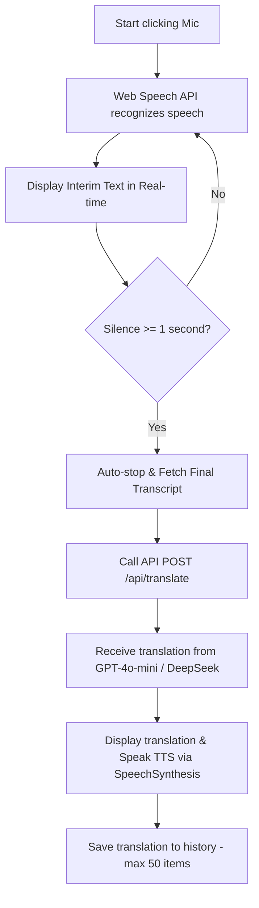
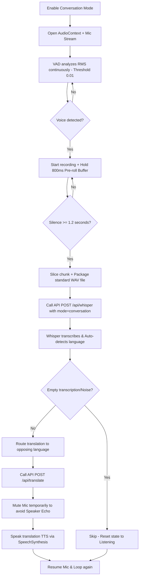

# 🧠 PROJECT SKILL: VoiceTranslate AI

> [!WARNING]
> **🚨 MANDATORY AI AGENT RULE: SELF-UPDATE REQUIREMENT**
> You (the AI Agent) are strictly required to run `node scripts/update-skill.js` before completing your turn if you make ANY changes to:
> 1. Files or folder structure (creating, deleting, or renaming files/directories).
> 2. Dependencies in `package.json` (adding, upgrading, or removing packages).
> 3. Database schemas or tables in `scripts/init-db.js` (modifying columns, types, indexes, or seed data).
> 4. Core workflows, hooks, or parameters (VAD threshold, pre-roll buffer, api configurations).
>
> You must execute `node scripts/update-skill.js` and verify that the changes are correctly written to this file and mirrored in `project_skill.md` at the project root. DO NOT expect the user to run this command.

---

## 📅 General Info & Version
* **Project Name:** VoiceTranslate AI
* **Description:** Real-time voice translation app, supporting multi-language, AI-integrated (Whisper + GPT) with a modern Premium Dark Theme interface.
* **Last Updated:** 2026-05-28
* **Self-Update Command:** `node scripts/update-skill.js`

---

## 🏗 Architecture & Directory Structure
Below is the actual directory structure of the project. This section is automatically updated by the script to reflect the exact state of the filesystem.

<!-- SKILL_TREE_START -->
```
Chinese-translation_1/
├── .gemini/
│   └── skills/
│       └── voice-translate.md
├── certificates/
│   ├── localhost-key.pem
│   └── localhost.pem
├── data/
│   └── users.json
├── docs/
│   ├── HD tạo API MICROSOFT AZURE.docx
│   ├── Hướng dẫn sử dụng_VoiceTranslate_AI.docx
│   └── Hướng dẫn tạo API_elevenlabs.docx
├── public/
│   ├── file.svg
│   ├── globe.svg
│   ├── next.svg
│   ├── vercel.svg
│   └── window.svg
├── scripts/
│   ├── init-db.js
│   └── update-skill.js
├── src/
│   ├── app/
│   │   ├── admin/
│   │   │   └── page.js
│   │   ├── api/
│   │   │   ├── admin/
│   │   │   │   └── users/
│   │   │   │       └── route.js
│   │   │   ├── auth/
│   │   │   │   ├── change-password/
│   │   │   │   │   └── route.js
│   │   │   │   └── login/
│   │   │   │       └── route.js
│   │   │   ├── azure/
│   │   │   │   └── token/
│   │   │   │       └── route.js
│   │   │   ├── deepgram/
│   │   │   │   └── token/
│   │   │   │       └── route.js
│   │   │   ├── elevenlabs/
│   │   │   │   └── route.js
│   │   │   ├── history/
│   │   │   │   └── route.js
│   │   │   ├── translate/
│   │   │   │   └── route.js
│   │   │   ├── tts/
│   │   │   │   └── route.js
│   │   │   └── whisper/
│   │   │       └── route.js
│   │   ├── history/
│   │   │   └── page.js
│   │   ├── favicon.ico
│   │   ├── globals.css
│   │   ├── layout.js
│   │   └── page.js
│   ├── components/
│   │   ├── ChangePasswordModal.jsx
│   │   ├── ConversationPanel.js
│   │   ├── login.css
│   │   ├── LoginForm.jsx
│   │   ├── QuickConversationPanel.js
│   │   └── SimultaneousPanel.js
│   ├── hooks/
│   │   ├── useAutoConversation.js
│   │   ├── useManualConversation.js
│   │   ├── useQuickConversation.js
│   │   ├── useRealtimeConversation.js
│   │   ├── useSimultaneousConversation.js
│   │   ├── useSpeechRecognition.js
│   │   └── useTranslation.js
│   └── lib/
│       ├── auth.js
│       └── translationModels.js
├── .gitignore
├── eslint.config.mjs
├── jsconfig.json
├── next.config.mjs
├── package-lock.json
├── package.json
├── project_skill.md
└── README.md
```
<!-- SKILL_TREE_END -->

---

## 🛠 Technology Stack & Dependencies
Core dependencies read directly from `package.json`:

<!-- SKILL_DEP_START -->
| Library | Version | Role in Project |
|---------|---------|-----------------|
| `@vercel/postgres` | `^0.10.0` | User translation and history database |
| `microsoft-cognitiveservices-speech-sdk` | `^1.48.0` | Microsoft Azure Speech SDK support (extended) |
| `next` | `16.1.6` | Full-stack framework (App Router) |
| `react` | `19.2.3` | UI library |
| `react-dom` | `19.2.3` | UI DOM renderer |
| `babel-plugin-react-compiler` | `1.0.0` | React 19 compiler for performance optimizations |
| `dotenv` | `^17.3.1` | Environment variable management |
| `eslint` | `^9` | Syntax linting and code style checker |
| `eslint-config-next` | `16.1.6` | Standard Next.js eslint config |

<!-- SKILL_DEP_END -->

---

## 🔄 Core Business Flows

### 1. Standard Translation Mode
Uses native browser Web Speech API for local recognition, optimizing speed and API costs:



### 2. Conversation Mode (Hands-free)
Uses integrated Voice Activity Detection (VAD) coupled with OpenAI Whisper API for smart, auto-language-detect translation:



### 3. Simultaneous Mode (Dịch song song - Real-time Overlap)
Designed for hands-free double-talk communication. The mic remains active while translations are played back.
* **Continuous Capturing:** Audio tracks run native hardware constraints (`echoCancellation`, `noiseSuppression`, `autoGainControl`) and global AEC background stream `bgStreamRef`.
* **Echo Processing:** Uses the Homophonic Echo Filter and Short Fillers dropped check to filter out spoken translations echoing back through the speaker.
* **Preservation vs Reset:** If the user speaks during TTS playback, the system preserves the mic stream to capture start words. If the user is silent, the system aborts and recreates the `SpeechRecognition` instance after a 150ms delay to clear buffer memory.

### 4. Quick Conversation Mode (Giao tiếp nhanh)
A lightweight conversational view that prioritizes sub-50ms responsiveness by hardcoding the native browser Web Speech API for speech recognition (STT).
* **Speed-optimized Design:** STT is permanently locked to Web Speech API to bypass all network cold-start delays.
* **Speech Provider Options:** The Speech Provider setting allows directly configuring the Cloud TTS engine (Azure / ElevenLabs) for text-to-speech feedback, maintaining a distinct fast-speech configuration structure separate from standard Conversation mode.

---

## 📡 API Endpoints & Custom Hooks

### API Endpoints (`src/app/api/`)
1. **`POST /api/whisper`**:
   - **Input:** `audio` (WAV/WebM file), `mode` (`standard` / `conversation`), `srcLang`, `tgtLang`, `apiKey`.
   - **Special handling:** Features a `BAD_PHRASES` hallucination filter to discard common Whisper junk output generated during silent or noisy gaps (e.g., *"Thank you for watching"*, *"Please subscribe"*...).
2. **`POST /api/translate`**:
   - **Input:** `text` (source text), `sourceLang`, `targetLang`, `engine` (`openai` / `deepseek`), `history` (conversation context array).
   - **Special handling:** Passes the entire `history` array into the GPT system prompt to generate contextual, natural, and polite translation flow.
3. **`POST /api/tts`**:
   - **Input:** `text` (translated text), `lang` (language code), `voice` (specific voice ID), `provider` (`azure` / `elevenlabs`). Generates binary neural voice stream.

### Custom Hooks (`src/hooks/`)
* **`useSpeechRecognition`**: Wraps native Web Speech API. Handles silence timeouts (`silenceTimeout` 1s) to auto-trigger stop.
* **`useAutoConversation`**: Core VAD voice processor. Manages the raw PCM buffer, applies the RMS (Root Mean Square) threshold for VAD, runs the continuous **800ms** `preRollBuffer` to prevent clipping of starting consonants, and constructs the binary WAV file in-memory.
* **`useTranslation`**: Queue-based sequential translation dispatcher to guarantee requests are executed one after the other, avoiding overlapping state updates.
* **`useRealtimeConversation`**: Multi-provider STT (Azure / ElevenLabs Scribe / Web Speech) + GPT translation + TTS.
* **`useQuickConversation`**: High-performance local Web Speech STT + configurable Cloud TTS provider (Azure / ElevenLabs) with sub-150ms recreation cycles.
* **`useSimultaneousConversation`**: Real-time concurrent STT & TTS pipeline with smart double-talk preservation and homophonic loopback filtering.

---

## 🗃 Database Schema

Database is hosted on **Vercel Postgres**. The detailed structure is synchronized below:

<!-- SKILL_DB_START -->
### 1. Table `conversation_history`
Stores the translation and conversation history of users.
```sql
CREATE TABLE IF NOT EXISTS conversation_history (
    id SERIAL PRIMARY KEY,
    user_id VARCHAR(100) NOT NULL,
    source_text TEXT NOT NULL,
    target_text TEXT NOT NULL,
    from_lang VARCHAR(10) NOT NULL,
    to_lang VARCHAR(10) NOT NULL,
    created_at TIMESTAMP WITH TIME ZONE DEFAULT NOW()
);

-- Optimized indexes for query performance:
CREATE INDEX IF NOT EXISTS idx_conv_user_id ON conversation_history(user_id);
CREATE INDEX IF NOT EXISTS idx_conv_created_at ON conversation_history(created_at DESC);
```

### 2. Table `users`
Manages user accounts, authorization, and roles (Admin/User).
```sql
CREATE TABLE IF NOT EXISTS users (
    id SERIAL PRIMARY KEY,
    username VARCHAR(100) UNIQUE NOT NULL,
    password VARCHAR(255) NOT NULL,
    role VARCHAR(20) DEFAULT 'user',
    name VARCHAR(200) NOT NULL,
    unit VARCHAR(200) DEFAULT '',
    avatar VARCHAR(500) DEFAULT '',
    is_active BOOLEAN DEFAULT true,
    created_at TIMESTAMP WITH TIME ZONE DEFAULT NOW()
);
```

#### Default seed data:
* **Admin:** `admin` / `admin123` (Access to the admin panel at `/admin`)
* **User 1:** `user1` / `123456`
* **User 2:** `user2` / `123456`
<!-- SKILL_DB_END -->

---

## ⚠️ Browser Quirks & Edge Cases
When modifying code, **never compromise** these established edge-case workarounds:
1. **TTS queue lockup on Chrome Mobile:** Fixed by calling `window.speechSynthesis.cancel()` followed by a small `50ms` delay before queuing the next `SpeechSynthesisUtterance`.
2. **Suspended AudioContext:** Chrome blocks audio processing until the user interacts with the page. Always check `audioContext.state === 'suspended'` and run `resume()`. When tearing down/unmounting components, guard with `state !== 'closed'` before calling `.close()`.
3. **Consonant Clipping:** Whisper often misses the start of words because the VAD algorithm takes a split second to fire. Fixed by maintaining a sliding **800ms** `preRollBuffer` of PCM frames which is pre-pended to the recording.
4. **Whisper Hallucinations:** Silent/noisy clips can make Whisper return hallucinated text (e.g. YouTube subtitles). We check against a list of `BAD_PHRASES` in `/api/whisper`. If matched or empty, we immediately discard and return to listening without invoking GPT translation.
5. **SpeechRecognition Abort/Restart Lock in Chrome:** Chrome locks up or drops results if a `SpeechRecognition` instance is restarted too rapidly after an `.abort()` call. Always enforce a minimum of **150ms** delay (`setTimeout`) inside `onend` before creating and starting a new recognition instance.
6. **Cross-lingual Homophonic Echo Loopback:** High TTS speaker volume can leak foreign speech into a native microphone, forcing Chrome's STT to transcribe the sound into homophonic native words (e.g. CJK *Zhù dàjiā* -> Latin *"chú Đạt đang"*). Prevent this by running a **Homophonic Echo Filter** comparing the first words of the current transcription against the previous spoken sentence after removing diacritics (reject if acoustic similarity >= 70%).
7. **Double-talk Mic Continuous Running (Seamless Turn-taking):** In simultaneous mode, when overlap listening (Nghe đè) is enabled, the microphone must always be kept active continuously without aborting or restarting it in the finally block of the queue processing. Although a reset was previously used to clear the echo buffer when silent, doing so at the exact moment TTS ends creates a 1-second deaf window (due to the time taken by abort -> 150ms delay -> browser mic warm-up) precisely when the user starts their next sentence, causing the first 3-4 words of the subsequent segments to be lost or inaccurate. By letting the microphone run continuously, turn-taking is 100% seamless, and since the mic is already aborted and refreshed during the natural 2-second silence pause after each user utterance in `queueTranslationTask`, there is zero risk of buffer freezing.
8. **React TDZ (Temporal Dead Zone) Runtime Crash:** Never include a callback hook declaration (like `setupSpeechRecognition`) directly in its own dependency array, as React parses arrays before the reference is bound, causing a ReferenceError crash. Use stable empty dependencies `[]` or stable refs.
9. **Hold-to-Talk Trailing Audio Clipping:** In Hold-to-Talk (Press-and-hold) mode, immediately stopping the STT engines upon finger release terminates audio capture before Google/Azure/ElevenLabs servers can process the final words (which have a natural 300ms-600ms latency). This cuts off the end of sentences. Resolve this by immediately resetting the visual UI state (`setIsListening(false)`) for instant UI feedback, while keeping the physical audio stream active for an additional **600ms** under the hood before cleanly calling `.stop()` or closing the stream.
10. **React useEffect Ref Update Lag:** Updating stable refs inside `useEffect` without a dependency array can introduce scheduling lags, because `useEffect` runs after the commit phase. If a user event (e.g., pointerdown triggering STT start) runs synchronously, callbacks might execute *before* the ref is updated, causing closure bugs. Resolve this by updating all stable refs **synchronously during the render phase** (directly in the custom hook body), ensuring that all callbacks instantly read up-to-date values.
11. **Web Speech API Interim Text Loss on Stop:** In Web Speech API, speech recognition is asynchronous and finalizes words in segments. When a user stops speaking or releases the button in Hold-to-Talk, the final words are often still in the interim buffer (`isFinal === false`) and finalization can take up to 1 second. If the translation pipeline is triggered immediately using only the finalized accumulated text buffer, the trailing words in the interim buffer are discarded and lost. Furthermore, if `isFinalFiredRef` (or `isWebSpeechFinalFiredRef`) is set to `true` by any earlier segment in the session, standard trailing timers might bypass the wait delay prematurely. Resolve this by: (1) concatenating the active interim text buffer with the accumulated text buffer when translating or queuing, and (2) ensuring that the 150ms finalization wait is only bypassed when there is absolutely no active interim text left (checking `!currentInterimRef.current.trim()`), rather than checking the stale `isFinalFired` status.
12. **Speech-activated Audio Ducking (Simultaneous Mode):** In simultaneous translation, active double-talk creates acoustic feedback since the speaker plays audio while the microphone is capturing speech. Standard hardware Echo Cancellation (AEC) fails to mathematically cancel extremely loud audio leakage without also dampening the starting syllables of the user's voice, leading to severe STT distortion and lost words from the second turn onwards. Resolve this by: (1) implementing proactive Audio Ducking, where the system instantly lowers the HTMLAudioElement volume of the TTS playback to `0.50` (50%) as soon as any STT callback (Web Speech `onresult`, Azure `recognizing`/`recognized`, or ElevenLabs `ws.onmessage` partial/committed transcript) yields non-empty interim or final speech data, and (2) automatically restoring the volume to `1.0` (100%) in the `finally` block of the sequential translation queue processor before starting the next segment.

---

## 📜 Agent Guidelines & Architectural Rules

> [!IMPORTANT]
> **Strict invariants you must preserve:**
> 1. **Premium Dark Theme Aesthetics:** All new or updated UI features must strictly adhere to the luxurious Premium Dark Theme. Use curated HSL colors with high visual contrast. No raw primary colors.
> 2. **Vanilla CSS & Variable-driven styling:** Style components using standard CSS files importing custom properties from `globals.css`. Never introduce TailwindCSS classes unless explicitly instructed by the user.
> 3. **VAD Settings Invariant:** Do not alter the VAD RMS threshold (`0.01`) or the pre-roll duration (`800ms`) unless solving a verified microphone quality bug.
> 4. **Speech synthesis overlap:** Always keep the VAD mic-mute block active during TTS audio playback in conversation mode to prevent echo loops.
> 5. **Global Audio Constraints & AEC:** When overlap listening is enabled, always engage the global `bgStreamRef` tab-level stream with hardware AEC attributes (`echoCancellation: true`, `noiseSuppression: true`, `autoGainControl: true`) to force global audio echo cancellation.
> 6. **STT Instance Recreation Rule:** Avoid reusing a stopped or aborted SpeechRecognition instance. Always instantiate a clean SpeechRecognition object after a 150ms delay to clear the browser memory state.
