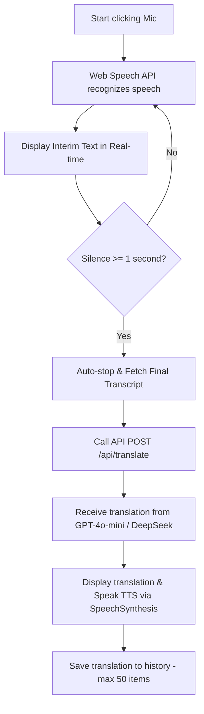
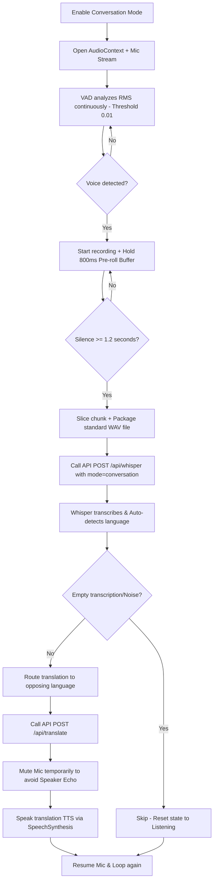

# 🧠 PROJECT SKILL: VoiceTranslate AI

> [!WARNING]
> **🚨 MANDATORY AI AGENT RULE: SELF-UPDATE REQUIREMENT**
> You (the AI Agent) are strictly required to run `node scripts/update-skill.js` before completing your turn if you make ANY changes to:
> 1. Files or folder structure (creating, deleting, or renaming files/directories).
> 2. Dependencies in `package.json` (adding, upgrading, or removing packages).
> 3. Database schemas or tables in `scripts/init-db.js` (modifying columns, types, indexes, or seed data).
> 4. Core workflows, hooks, or parameters (VAD threshold, pre-roll buffer, api configurations).
>
> You must execute `node scripts/update-skill.js` and verify that the changes are correctly written to this file and mirrored in `project_skill.md` at the project root. DO NOT expect the user to run this command.

---

## 📅 General Info & Version
* **Project Name:** VoiceTranslate AI
* **Description:** Real-time voice translation app, supporting multi-language, AI-integrated (Whisper + GPT) with a modern Premium Dark Theme interface.
* **Last Updated:** 2026-05-26
* **Self-Update Command:** `node scripts/update-skill.js`

---

## 🏗 Architecture & Directory Structure
Below is the actual directory structure of the project. This section is automatically updated by the script to reflect the exact state of the filesystem.

<!-- SKILL_TREE_START -->
```
Chinese-translation_1/
├── .gemini/
│   └── skills/
│       └── voice-translate.md
├── certificates/
│   ├── localhost-key.pem
│   └── localhost.pem
├── data/
│   └── users.json
├── docs/
│   ├── HD tạo API MICROSOFT AZURE.docx
│   ├── Hướng dẫn sử dụng_VoiceTranslate_AI.docx
│   └── Hướng dẫn tạo API_elevenlabs.docx
├── public/
│   ├── file.svg
│   ├── globe.svg
│   ├── next.svg
│   ├── vercel.svg
│   └── window.svg
├── scripts/
│   ├── init-db.js
│   └── update-skill.js
├── src/
│   ├── app/
│   │   ├── admin/
│   │   │   └── page.js
│   │   ├── api/
│   │   │   ├── admin/
│   │   │   │   └── users/
│   │   │   │       └── route.js
│   │   │   ├── auth/
│   │   │   │   ├── change-password/
│   │   │   │   │   └── route.js
│   │   │   │   └── login/
│   │   │   │       └── route.js
│   │   │   ├── azure/
│   │   │   │   └── token/
│   │   │   │       └── route.js
│   │   │   ├── deepgram/
│   │   │   │   └── token/
│   │   │   │       └── route.js
│   │   │   ├── elevenlabs/
│   │   │   │   └── route.js
│   │   │   ├── history/
│   │   │   │   └── route.js
│   │   │   ├── translate/
│   │   │   │   └── route.js
│   │   │   ├── tts/
│   │   │   │   └── route.js
│   │   │   └── whisper/
│   │   │       └── route.js
│   │   ├── history/
│   │   │   └── page.js
│   │   ├── favicon.ico
│   │   ├── globals.css
│   │   ├── layout.js
│   │   └── page.js
│   ├── components/
│   │   ├── ChangePasswordModal.jsx
│   │   ├── ConversationPanel.js
│   │   ├── login.css
│   │   ├── LoginForm.jsx
│   │   └── SimultaneousPanel.js
│   ├── hooks/
│   │   ├── useAutoConversation.js
│   │   ├── useManualConversation.js
│   │   ├── useRealtimeConversation.js
│   │   ├── useSimultaneousConversation.js
│   │   ├── useSpeechRecognition.js
│   │   └── useTranslation.js
│   └── lib/
│       ├── auth.js
│       └── translationModels.js
├── .gitignore
├── eslint.config.mjs
├── jsconfig.json
├── next.config.mjs
├── package-lock.json
├── package.json
├── project_skill.md
└── README.md
```
<!-- SKILL_TREE_END -->

---

## 🛠 Technology Stack & Dependencies
Core dependencies read directly from `package.json`:

<!-- SKILL_DEP_START -->
| Library | Version | Role in Project |
|---------|---------|-----------------|
| `@vercel/postgres` | `^0.10.0` | User translation and history database |
| `microsoft-cognitiveservices-speech-sdk` | `^1.48.0` | Microsoft Azure Speech SDK support (extended) |
| `next` | `16.1.6` | Full-stack framework (App Router) |
| `react` | `19.2.3` | UI library |
| `react-dom` | `19.2.3` | UI DOM renderer |
| `babel-plugin-react-compiler` | `1.0.0` | React 19 compiler for performance optimizations |
| `dotenv` | `^17.3.1` | Environment variable management |
| `eslint` | `^9` | Syntax linting and code style checker |
| `eslint-config-next` | `16.1.6` | Standard Next.js eslint config |

<!-- SKILL_DEP_END -->

---

## 🔄 Core Business Flows

### 1. Standard Translation Mode
Uses native browser Web Speech API for local recognition, optimizing speed and API costs:



### 2. Conversation Mode (Hands-free)
Uses integrated Voice Activity Detection (VAD) coupled with OpenAI Whisper API for smart, auto-language-detect translation:



---

## 📡 API Endpoints & Custom Hooks

### API Endpoints (`src/app/api/`)
1. **`POST /api/whisper`**:
   - **Input:** `audio` (WAV/WebM file), `mode` (`standard` / `conversation`), `srcLang`, `tgtLang`, `apiKey`.
   - **Special handling:** Features a `BAD_PHRASES` hallucination filter to discard common Whisper junk output generated during silent or noisy gaps (e.g., *"Thank you for watching"*, *"Please subscribe"*...).
2. **`POST /api/translate`**:
   - **Input:** `text` (source text), `sourceLang`, `targetLang`, `engine` (`openai` / `deepseek`), `history` (conversation context array).
   - **Special handling:** Passes the entire `history` array into the GPT system prompt to generate contextual, natural, and polite translation flow.

### Custom Hooks (`src/hooks/`)
* **`useSpeechRecognition`**: Wraps native Web Speech API. Handles silence timeouts (`silenceTimeout` 1s) to auto-trigger stop.
* **`useAutoConversation`**: Core VAD voice processor. Manages the raw PCM buffer, applies the RMS (Root Mean Square) threshold for VAD, runs the continuous **800ms** `preRollBuffer` to prevent clipping of starting consonants, and constructs the binary WAV file in-memory.
* **`useTranslation`**: Queue-based sequential translation dispatcher to guarantee requests are executed one after the other, avoiding overlapping state updates.

---

## 🗃 Database Schema

Database is hosted on **Vercel Postgres**. The detailed structure is synchronized below:

<!-- SKILL_DB_START -->
### 1. Table `conversation_history`
Stores the translation and conversation history of users.
```sql
CREATE TABLE IF NOT EXISTS conversation_history (
    id SERIAL PRIMARY KEY,
    user_id VARCHAR(100) NOT NULL,
    source_text TEXT NOT NULL,
    target_text TEXT NOT NULL,
    from_lang VARCHAR(10) NOT NULL,
    to_lang VARCHAR(10) NOT NULL,
    created_at TIMESTAMP WITH TIME ZONE DEFAULT NOW()
);

-- Optimized indexes for query performance:
CREATE INDEX IF NOT EXISTS idx_conv_user_id ON conversation_history(user_id);
CREATE INDEX IF NOT EXISTS idx_conv_created_at ON conversation_history(created_at DESC);
```

### 2. Table `users`
Manages user accounts, authorization, and roles (Admin/User).
```sql
CREATE TABLE IF NOT EXISTS users (
    id SERIAL PRIMARY KEY,
    username VARCHAR(100) UNIQUE NOT NULL,
    password VARCHAR(255) NOT NULL,
    role VARCHAR(20) DEFAULT 'user',
    name VARCHAR(200) NOT NULL,
    unit VARCHAR(200) DEFAULT '',
    avatar VARCHAR(500) DEFAULT '',
    is_active BOOLEAN DEFAULT true,
    created_at TIMESTAMP WITH TIME ZONE DEFAULT NOW()
);
```

#### Default seed data:
* **Admin:** `admin` / `admin123` (Access to the admin panel at `/admin`)
* **User 1:** `user1` / `123456`
* **User 2:** `user2` / `123456`
<!-- SKILL_DB_END -->

---

## ⚠️ Browser Quirks & Edge Cases
When modifying code, **never compromise** these established edge-case workarounds:
1. **TTS queue lockup on Chrome Mobile:** Fixed by calling `window.speechSynthesis.cancel()` followed by a small `50ms` delay before queuing the next `SpeechSynthesisUtterance`.
2. **Suspended AudioContext:** Chrome blocks audio processing until the user interacts with the page. Always check `audioContext.state === 'suspended'` and run `resume()`. When tearing down/unmounting components, guard with `state !== 'closed'` before calling `.close()`.
3. **Consonant Clipping:** Whisper often misses the start of words because the VAD algorithm takes a split second to fire. Fixed by maintaining a sliding **800ms** `preRollBuffer` of PCM frames which is pre-pended to the recording.
4. **Whisper Hallucinations:** Silent/noisy clips can make Whisper return hallucinated text (e.g. YouTube subtitles). We check against a list of `BAD_PHRASES` in `/api/whisper`. If matched or empty, we immediately discard and return to listening without invoking GPT translation.

---

## 📜 Agent Guidelines & Architectural Rules

> [!IMPORTANT]
> **Strict invariants you must preserve:**
> 1. **Premium Dark Theme Aesthetics:** All new or updated UI features must strictly adhere to the luxurious Premium Dark Theme. Use curated HSL colors with high visual contrast. No raw primary colors.
> 2. **Vanilla CSS & Variable-driven styling:** Style components using standard CSS files importing custom properties from `globals.css`. Never introduce TailwindCSS classes unless explicitly instructed by the user.
> 3. **VAD Settings Invariant:** Do not alter the VAD RMS threshold (`0.01`) or the pre-roll duration (`800ms`) unless solving a verified microphone quality bug.
> 4. **Speech synthesis overlap:** Always keep the VAD mic-mute block active during TTS audio playback in conversation mode to prevent echo loops.
